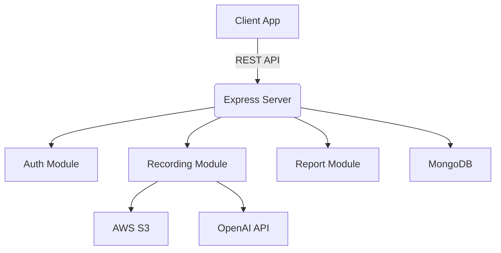

# Coach AI Backend

Coach AI Backend is a Node.js/TypeScript REST API that powers a public speaking and communication skills coaching platform. It leverages AI (OpenAI) to analyze users’ speech recordings, provide actionable feedback, and track progress over time. The backend is built with Express, MongoDB, and integrates with AWS S3 for audio storage.

## Table of Contents

- [Features](#features)
- [Architecture Overview](#architecture-overview)
- [API Endpoints](#api-endpoints)
- [Setup & Installation](#setup--installation)
- [Environment Variables](#environment-variables)
- [Scripts](#scripts)
- [Tech Stack](#tech-stack)
- [Contributing](#contributing)
- [License](#license)

---

## Features

- **User Authentication**: Secure signup/signin with JWT-based authentication and admin support.
- **Speech Recording Analysis**: Upload audio recordings, which are transcribed and analyzed for metrics like words per minute, filler rate, pauses, sentiment, and more.
- **AI Feedback**: Actionable, AI-generated advice for improving public speaking, based on both current and historical performance.
- **Prompt Generation**: AI-generated speaking prompts for practice, tailored to user-selected topics.
- **Progress Tracking**: Stores reports and metrics for each session, enabling users to track their improvement.
- **Secure File Uploads**: Uses AWS S3 for audio storage with presigned URLs.
- **Role-based Access**: Admin and user roles with appropriate route protection.

---

## Architecture Overview



- **Express Server**: Handles routing, middleware, and error handling.
- **MongoDB**: Stores users, prompts, reports, and metrics.
- **AWS S3**: Stores user-uploaded audio files.
- **OpenAI API**: Used for transcription, prompt generation, and feedback.

---

## API Endpoints

### Auth

- `POST /auth/signup` — Register a new user.
- `POST /auth/signin` — Login and receive JWT tokens.

### Recording

- `POST /upload/upload-url` — Get a presigned S3 URL for uploading audio (auth required).
- `POST /recording/` — Submit a recording for analysis (auth required).
- `GET /recording/prompt` — Get a new AI-generated speaking prompt (auth required).

### Reports

- `GET /reports/` — List user’s past reports and feedback (auth required).

> **Note:** All protected routes require a valid JWT in the `Authorization` header.

---

## Setup & Installation

### Prerequisites

- Node.js (v18+ recommended)
- MongoDB instance (local or cloud)
- AWS S3 bucket
- OpenAI API key

### 1. Clone the repository

```bash
git clone <repo-url>
cd coach-ai-backend
```

### 2. Install dependencies

```bash
npm install
```

### 3. Configure environment variables

Create a `.env` file in the root directory with the following variables:

```
PORT=4000
APP_URI=http://localhost
MONGODB_URI=mongodb://localhost:27017/coach-ai
JWT_ACCESS_SECRET=your_jwt_access_secret
JWT_REFRESH_SECRET=your_jwt_refresh_secret
CLIENT_ORIGIN=http://localhost:3000
OPENAI_API_KEY=your_openai_api_key
ADMIN_EMAIL=admin@example.com
AWS_REGION=your_aws_region
S3_BUCKET=your_s3_bucket_name
AWS_ACCESS_KEY_ID=your_aws_access_key
AWS_SECRET_ACCESS_KEY=your_aws_secret_key
```

### 4. Run the development server

```bash
npm run dev
```

The API will be available at `http://localhost:4000` (or your configured port).

---

## Scripts

- `npm run dev` — Start the server in development mode with hot-reloading.
- `npm run build` — Compile TypeScript to JavaScript.
- `npm start` — Run the compiled server from `dist/`.

---

## Tech Stack

- **Node.js** & **Express** — REST API server
- **TypeScript** — Type safety
- **MongoDB** & **Mongoose** — Database and ODM
- **OpenAI API** — AI transcription, prompt, and feedback
- **AWS S3** — Audio file storage
- **JWT** — Authentication
- **Helmet, CORS** — Security

---

## Contributing

Contributions are welcome! Please open issues or submit pull requests for improvements or bug fixes.

---

## License

This project is licensed under the ISC License.

---

**For recruiters and engineers:**  
This backend is designed for a modern, AI-powered coaching platform. It demonstrates secure authentication, cloud integration, and advanced AI features, all with clean, modular TypeScript code. Please see the codebase for further details on architecture and implementation. 